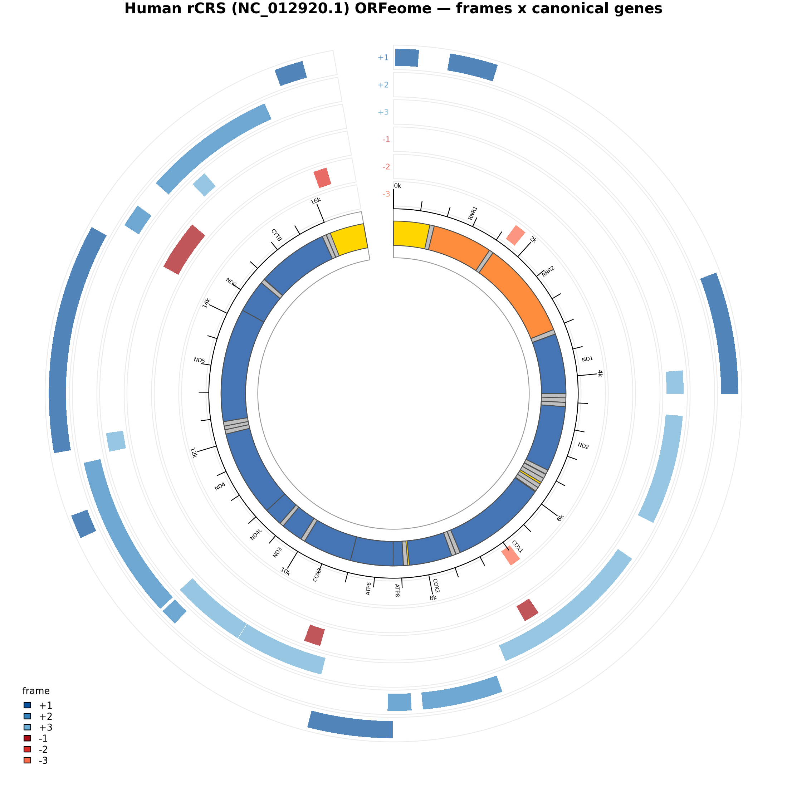

# MitoDiveR

**Comparative mitochondrial genomics in R**

MitoDiveR is an R toolkit for comparative analysis, annotation parsing, and visualization of mitochondrial genomes across species. The package is designed to facilitate evolutionary and functional investigations of mitogenome structure, gene content, and sequence variation in a reproducible workflow.

---

## Overview

Mitochondrial genomes play central roles in metabolism, aging, and evolutionary diversification. Comparative analysis of mitogenomes across taxa can reveal patterns of gene retention, rearrangement, sequence divergence, and adaptation.

MitoDiveR provides tools to:

* Import and parse mitochondrial genome annotations
* Extract gene sequences and features
* Compare gene content and order across taxa
* Analyze sequence divergence and variation
* Prepare data for phylogenetic and evolutionary analyses
* Generate publication-ready visualizations

The package is designed for researchers in evolutionary biology, genomics, fisheries science, and comparative physiology.

---

## Example: six-frame ORFeome map

`plot_orfeome_circos()` places every open reading frame across all six reading
frames (outer rings, `+1/+2/+3` then `-1/-2/-3`) against the canonical gene
annotation and nucleotide coordinates (central ring). Human mitogenome
(rCRS, `NC_012920.1`), nested ORFs collapsed to distinct loci:



---

## Installation

MitoDiveR is currently available from GitHub.

```r
install.packages("remotes")
remotes::install_github("evozoa/MitoDiveR")
```

---

## Quick Start

```r
library(MitoDiveR)

# Fetch a mitogenome (sequence + parsed GenBank features) from NCBI
human <- fetch_mito_genbank("NC_012920.1")[["NC_012920.1"]]

# Detect ORFs across all six reading frames. The genetic code must be chosen
# explicitly: "SGC1" = vertebrate mitochondrial, "SGC0" = standard.
orfs <- scan_orfs(
  Biostrings::DNAStringSet(human$sequence),
  genetic_code   = "SGC1",
  min_orf_length = 150
)

# Circos map of the six-frame ORFeome against the canonical gene annotation
plot_orfeome_circos(
  orfs,
  genome_length = nchar(as.character(human$sequence)),
  genes         = human$features
)

# Assess a variant's effect on noncanonical ORFs (and, optionally, RNA structure)
analyze_snp("m.3206C>T", genetic_codes = c("SGC1", "SGC0"), rna_structure = TRUE)
```

---

## Key Functions

### Data import

* `fetch_sequences()` — fetch sequences from NCBI accessions or FASTA
* `fetch_mito_genbank()` — fetch a mitogenome with parsed GenBank features

### ORF detection & annotation

* `find_orfs()` / `scan_orfs()` — six-frame ORF detection (one or many sequences)
* `scan_orfeome()` — scan across multiple genetic codes, lengths, and start-codon sets
* `translate_all_frames()` — translate a genome in all six frames
* `annotate_genomic_regions()` — label ORFs by canonical gene region
* `collapse_nested_orfs()` — reduce nested ORFs to one locus per stop

### Comparative & conservation analysis

* `compare_mitogenomes()` — pairwise mutation table + per-SNP coding/MDP impact
* `find_conserved_orfs()` / `cluster_conserved_orfs()` — cluster ORFs across genomes
* `find_clade_conserved_orfs()` — fetch a taxon's mitogenomes → scan → cluster
* `find_conserved_windows()` — conserved peptide windows from whole-genome translation
* `calc_dnds()`, `calc_codon_usage()`, `calc_codon_position_rates()` — divergence and codon statistics

### Variant analysis

* `analyze_snp()` — SNP-first: a variant's effect on noncanonical ORFs (and RNA structure)
* `characterize_transcript_snps()` — transcript-first: survey SNPs within a transcript (MITOMAP for human, NCBI otherwise)
* `analyze_protein_impacts()` — BLOSUM62 / hydropathy / secondary-structure propensities

### RNA & protein structure

* `fold_rna()`, `pair_partners()`, `longest_stem()`, `circular_lstrand_transcript()` — RNA secondary structure
* `predict_esmfold()`, `esmfold_plddt()`, `predict_tmhmm()`, `tmhmm_domains()` — protein structure / topology

### Mitochondrial-derived peptides (MDPs)

* `mdp_sequences()`, `score_mdp_similarity()`, `search_mdp_homologs()` — MDP reference set and homology search

### Visualization

* `plot_orfeome_circos()` — six-frame ORFeome circos plot (see example above)

---

## Use Cases

MitoDiveR is particularly suited for:

* Comparative mitogenomics across clades
* Evolution of mitochondrial gene content
* Structural rearrangement analysis
* Phylogenetic dataset preparation
* Integrative studies of mitonuclear evolution

---

## Relationship to SNPmineR

MitoDiveR complements the SNPmineR package, which focuses on cross-species mapping of nuclear variants. Together, these tools enable integrated analyses of nuclear and mitochondrial genomic evolution.

---

## Development Status

MitoDiveR is under active development. Features and function names may change prior to the first stable release.

Planned milestones:

* v0.1 — Core import and parsing
* v0.5 — Comparative analyses and visualization
* v1.0 — Stable release

---

## Contributing

Contributions, feature requests, and bug reports are welcome via GitHub Issues and Pull Requests.

---

## Citation

If you use MitoDiveR in your research, please cite the package (citation details forthcoming).

---

## License

MIT License

---

## Contact

Maintained by Michael W. Sandel
Mississippi State University
Laboratory of Aquatic Evolution
